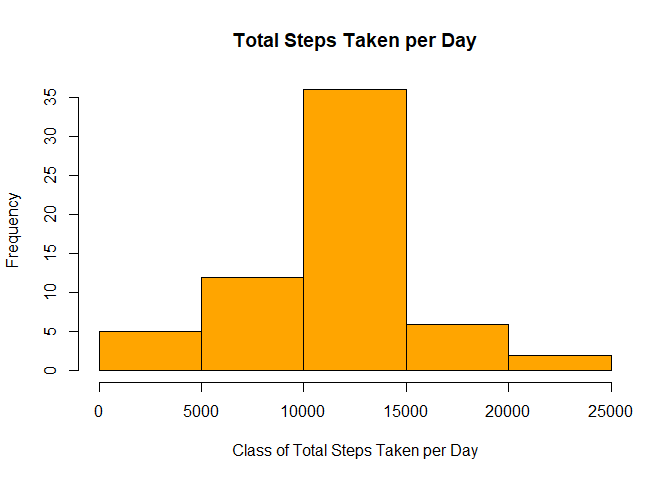

### 1. Read and Process the Data


```r
# Load required libraries
library(tidyverse)
```

```
## -- Attaching packages --------------------------------------- tidyverse 1.3.0 --
```

```
## v ggplot2 3.3.2     v purrr   0.3.4
## v tibble  3.0.4     v dplyr   1.0.2
## v tidyr   1.1.2     v stringr 1.4.0
## v readr   1.4.0     v forcats 0.5.0
```

```
## -- Conflicts ------------------------------------------ tidyverse_conflicts() --
## x dplyr::filter() masks stats::filter()
## x dplyr::lag()    masks stats::lag()
```

```r
library(lubridate)
```

```
## 
## Attaching package: 'lubridate'
```

```
## The following objects are masked from 'package:base':
## 
##     date, intersect, setdiff, union
```

```r
library(glue)
```

```
## 
## Attaching package: 'glue'
```

```
## The following object is masked from 'package:dplyr':
## 
##     collapse
```


```r
# Load in data file
df <- read.csv("activity.csv")
df$date <- ymd(df$date)  #change the date field from factor to date
```

### 2. Histogram of the total number of steps taken each day

```r
dailysteps <- aggregate(steps~date, df, sum)

hist (dailysteps$steps, col = "orangered",
                        main = "Total Steps Taken per Day",
                        xlab = "Class of Total Steps Taken per Day",
                        ylab = "Frequency")
```

<!-- -->

### 3. Mean and median number of steps taken each day

```r
steps_mean <- mean(dailysteps$steps)
steps_median <- median(dailysteps$steps)
glue("Mean number of daily steps: {steps_mean}")
```

```
## Mean number of daily steps: 10766.1886792453
```

```r
glue("Median number of daily steps: {steps_median}")
```

```
## Median number of daily steps: 10765
```

### 4. Time series plot of the average number of steps taken

   Make a time series plot (i.e. type = "l") of the 5-minute interval (x-axis) and the average number of steps taken, averaged across all days (y-axis)

```r
avgStepsbyInterval <- aggregate(steps~interval, df, mean)

with(avgStepsbyInterval, plot (interval, steps, type="l",
                             xlab="Interval",
                             ylab="Average number of steps",
                             main="Average number of Steps per Daily Interval"))
```

<!-- -->


### 5. The 5-minute interval that, on average, contains the maximum number of steps

```r
avgStepsbyInterval %>% 
  select(interval, steps) %>% 
    filter(steps == max(avgStepsbyInterval$steps))
```

```
##   interval    steps
## 1      835 206.1698
```


### 6. Code to describe and show a strategy for imputing missing data
  There are a number of days/intervals where there are missing values (coded as "NA""). The presence of missing days may introduce bias into some calculations or summaries of the data.


```r
glue("For example, here are the first six entries of the data set:")
```

```
## For example, here are the first six entries of the data set:
```

```r
head(df)
```

```
##   steps       date interval
## 1    NA 2012-10-01        0
## 2    NA 2012-10-01        5
## 3    NA 2012-10-01       10
## 4    NA 2012-10-01       15
## 5    NA 2012-10-01       20
## 6    NA 2012-10-01       25
```

6.1 Calculate and report the total number of missing values in the dataset (i.e. the total number of rows with "NA" values)

```r
numNA <- sum(is.na(df$steps))
glue("The total number of missing values: {numNA}")
```

```
## The total number of missing values: 2304
```


6.2 Devise a strategy for filling in all of the missing values in the dataset. The strategy does not need to be sophisticated. For example, you could use the mean/median for that day, or the mean for that 5-minute interval, etc.

 - I am going to replace the missing values with the average step value for a 5-minute interval
 

```r
avgSteps <- mean(avgStepsbyInterval$steps, na.rm = TRUE)
glue("The average step value is: {avgSteps}")
```

```
## The average step value is: 37.3825995807128
```
 

6.3 Create a new dataset that is equal to the original dataset but with the missing data filled in.
 

```r
index_missing_data <- is.na(df[,1])
df_imputed <- df
df_imputed[index_missing_data,1] <- avgSteps
glue("Here are the first six entries of the data set after imputation:")
```

```
## Here are the first six entries of the data set after imputation:
```

```r
head(df_imputed)
```

```
##     steps       date interval
## 1 37.3826 2012-10-01        0
## 2 37.3826 2012-10-01        5
## 3 37.3826 2012-10-01       10
## 4 37.3826 2012-10-01       15
## 5 37.3826 2012-10-01       20
## 6 37.3826 2012-10-01       25
```


### 7. Histogram of the total number of steps taken each day after missing values are imputed


```r
dailysteps_imputed <- aggregate(steps~date, df_imputed, sum)

hist (dailysteps_imputed$steps, col = "orange",
                        main = "Total Steps Taken per Day",
                        xlab = "Class of Total Steps Taken per Day",
                        ylab = "Frequency")
```

<!-- -->

These values DO differ from the values from the first part of the assignment.  The original histogram ignored the N/A values.  Now, replacing N/As with the average value of the particular 5-minute interval has resulted in a higher frequency of 5-minute interval averages in the "center" class of the histogram (i.e. around the mean, which is what we replaced the N/As with).


7.1 Calculate and report the mean and median total number of steps taken per day. Do these values differ from the estimates from the first part of the assignment? What is the impact of imputing missing data on the estimates of the total daily number of steps?


```r
steps_mean_imputed <- mean(dailysteps_imputed$steps)
steps_median_imputed <- median(dailysteps_imputed$steps)

glue("Original mean: {steps_mean} vs. Imputed Mean: {steps_mean_imputed}")
```

```
## Original mean: 10766.1886792453 vs. Imputed Mean: 10766.1886792453
```

```r
glue("Original median: {steps_median} vs. Imputed Median: {steps_median_imputed}")
```

```
## Original median: 10765 vs. Imputed Median: 10766.1886792453
```

The mean values do not differ at all.  The median values are only slightly different.


### 8. Panel plot comparing the average number of steps taken per 5-minute interval across weekdays and weekends

8.1 Create a new factor variable in the dataset with two levels - "weekday" and "weekend" indicating whether a given date is a weekday or weekend day.


```r
day_of_week <- df_imputed %>%
  mutate(Day_type = case_when(wday(date) %in% 2:6 ~ "Weekday",
                              wday(date) %in% c(1,7) ~ "Weekend")) %>%
    select(-date) %>%
      group_by(interval, Day_type) %>%
        summarise(steps = mean(steps))
```

```
## `summarise()` regrouping output by 'interval' (override with `.groups` argument)
```

8.2 Make a panel plot containing a time series plot (i.e. type = "l") of the 5-minute interval (x-axis) and the average number of steps taken, averaged across all weekday days or weekend days (y-axis).


```r
ggplot(day_of_week, aes(x=interval, y=steps, color=Day_type)) + 
  geom_line() + 
  facet_wrap(~Day_type, nrow = 2) +
  labs(title = "Average Daily Steps by Type of Day",
           x = "Interval",
           y = "Average Number of Steps")+
  theme(legend.position="bottom")
```

<!-- -->
